# Data-Flow Architecture: RAG-Based Mutual Fund FAQ Chatbot

> Companion to `Docs/architecture.md` and `Docs/context.md`.
> This document focuses **exclusively on how data moves** through the system — from raw source URLs to a rendered, compliant answer. Every stage shows its inputs, transformations, outputs, and the data contracts between components. All diagrams use Mermaid.
>
> **Cost posture:** 100% free stack — local `sentence-transformers` embeddings, local ChromaDB/FAISS, and the Groq free-tier LLM API. No paid service appears in any data path.

---

## 1. Legend & Conventions

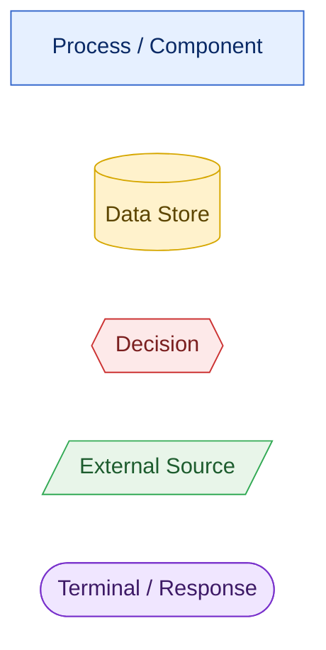

| Symbol | Meaning |
|--------|---------|
| Blue rectangle | Processing component (transforms data) |
| Yellow cylinder | Persistent data store |
| Red diamond | Decision / branch point |
| Green parallelogram | External data source (web/PDF/LLM API) |
| Purple stadium | Terminal output returned to the user |

Two planes carry data:
- **Ingestion plane (offline, write-path):** URLs → vector index. Runs occasionally.
- **Serving plane (online, read-path):** user query → answer. Runs per request, read-only against the index.

---

## 2. Top-Level Data Context (C4-style)

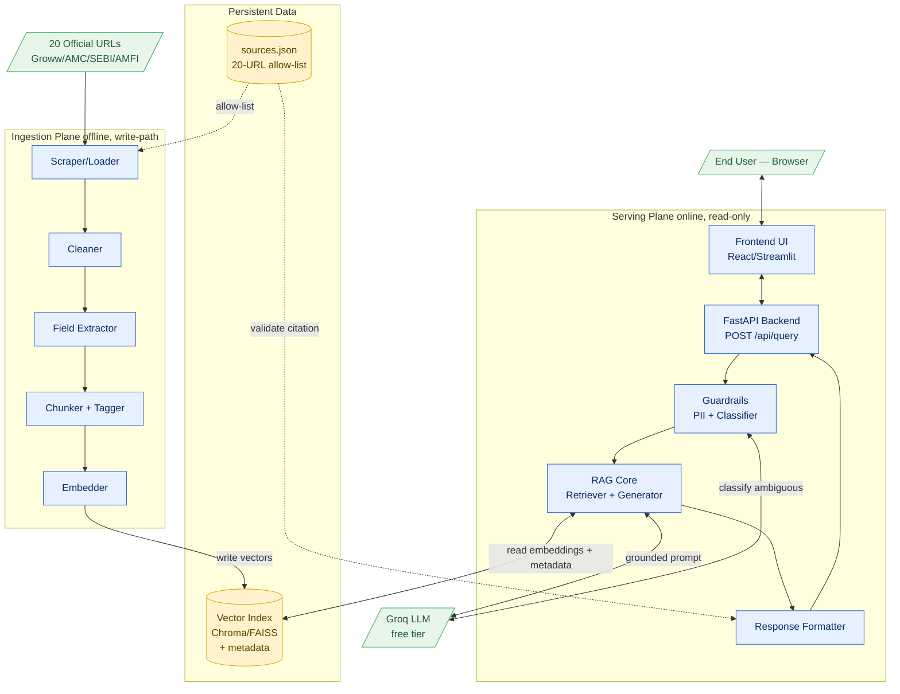

**Key data boundary:** the Vector Index is the *only* shared state between the two planes. Ingestion **writes** it; serving **reads** it. They never run in the same request.

---

## 3. Ingestion Plane — Detailed Data Flow

### 3.1 Stage-by-stage pipeline

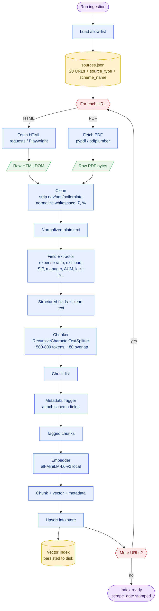

### 3.2 Data transformation table (what each stage produces)

| Stage | Input | Transformation | Output | Free tooling |
|-------|-------|----------------|--------|--------------|
| Load allow-list | `sources.json` | Parse 20 entries (url, source_type, scheme_name, category) | URL work-queue | json (stdlib) |
| Fetch | URL | HTTP GET / headless render / PDF read | Raw HTML or PDF text | requests, Playwright, pypdf |
| Clean | Raw markup | Remove nav/ads/scripts; normalize Unicode, ₹, % | Plain normalized text | BeautifulSoup, custom |
| Extract | Plain text | Regex/selectors pull structured data points | Field dict + body text | custom Python |
| Chunk | Text + fields | Split with overlap, keep semantic boundaries | List of text chunks | LangChain splitter |
| Tag | Chunks | Attach metadata schema (below) | Tagged chunks | custom |
| Embed | Chunk text | Encode to dense vector (384-dim for MiniLM) | `(text, vector, metadata)` | sentence-transformers |
| Upsert | Vector records | Write to Chroma/FAISS, persist to disk | Vector index files | ChromaDB / FAISS |

### 3.3 Chunk record — the core data contract

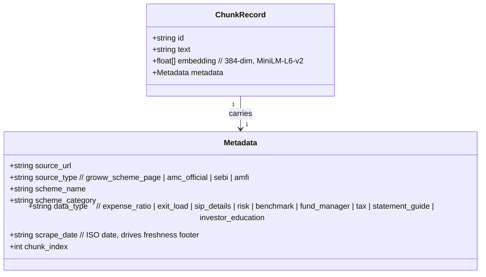

```json
{
  "id": "groww_midcap_0007",
  "text": "The expense ratio of HDFC Mid Cap Fund Direct Growth is 0.74% ...",
  "embedding": [0.0123, -0.0456, "... 384 dims ..."],
  "metadata": {
    "source_url": "https://groww.in/mutual-funds/hdfc-mid-cap-fund-direct-growth",
    "source_type": "groww_scheme_page",
    "scheme_name": "HDFC Mid Cap Fund Direct Growth",
    "scheme_category": "Equity — Mid Cap",
    "data_type": "expense_ratio",
    "scrape_date": "2026-06-23",
    "chunk_index": 7
  }
}
```

> **Why this matters downstream:** `source_url` → citation, `scrape_date` → freshness footer, `data_type` + `scheme_name` → metadata pre-filtering at retrieval, `source_type` → ranking priority. The serving plane derives every compliance guarantee from this metadata, not from the LLM.

---

## 4. Serving Plane — End-to-End Request Data Flow

### 4.1 Master flow (all branches)

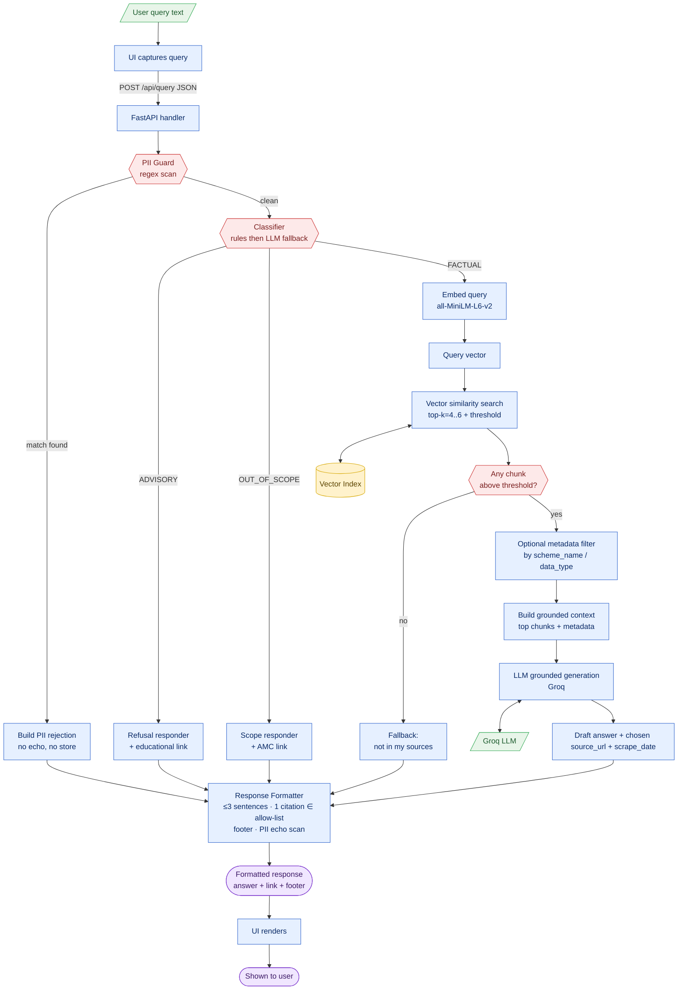

### 4.2 Sequence diagram — the FACTUAL happy path

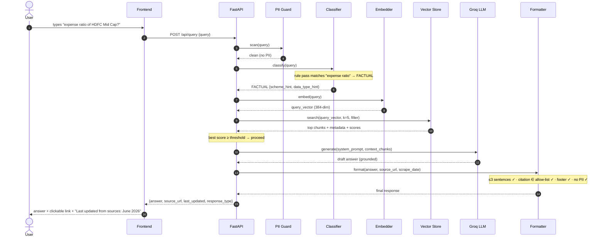

### 4.3 Sequence diagram — PII rejection (short-circuit)

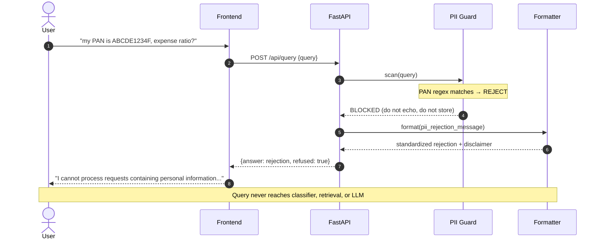

---

## 5. Decision Logic Data Flow

### 5.1 PII Guard — deterministic gate

```mermaid
flowchart TD
    inp[/Clean-input candidate/]:::ext --> pan{{PAN<br/>[A-Z]5[0-9]4[A-Z]?}}:::dec
    pan -->|yes| block
    pan -->|no| aad{{Aadhaar<br/>12 digits?}}:::dec
    aad -->|yes| block
    aad -->|no| ph{{Phone<br/>[6-9] + 9 digits?}}:::dec
    ph -->|yes| block
    ph -->|no| em{{Email<br/>regex?}}:::dec
    em -->|yes| block
    em -->|no| acc{{Account no.<br/>8-18 digits?}}:::dec
    acc -->|yes| block
    acc -->|no| otp{{OTP<br/>4-6 digits in context?}}:::dec
    otp -->|yes| block
    otp -->|no| pass([Pass to Classifier]):::term
    block([REJECT — no echo, no store]):::term

    classDef dec fill:#fde9e9,stroke:#cc3333,color:#7a1f1f
    classDef ext fill:#e8f5e9,stroke:#33aa55,color:#1d5c2e
    classDef term fill:#f0e6ff,stroke:#7a33cc,color:#3d1a66
```

### 5.2 Classifier — hybrid routing (rules first, LLM fallback)

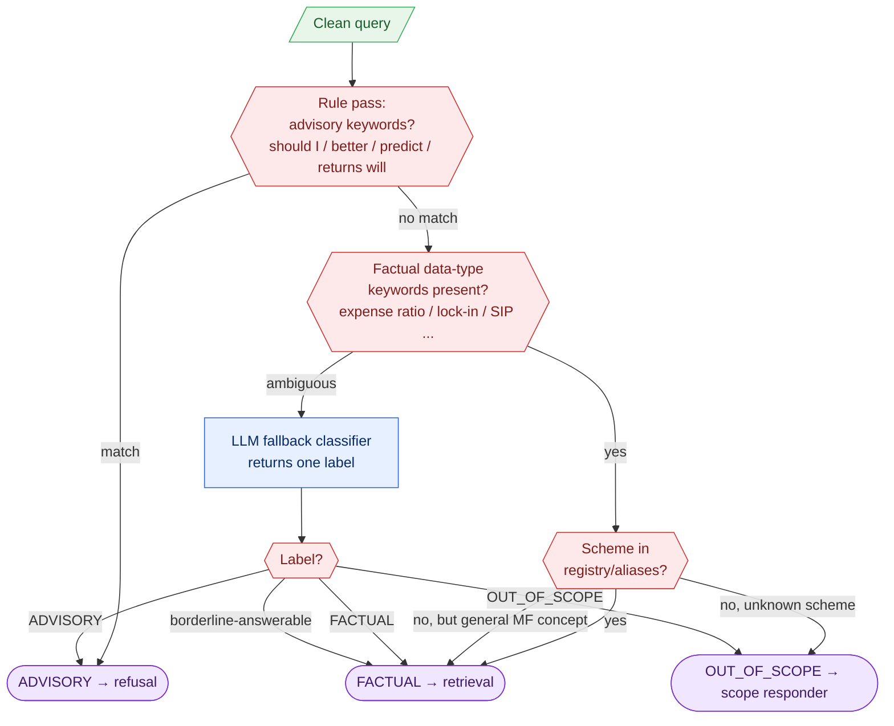

### 5.3 Retrieval scoring & citation selection

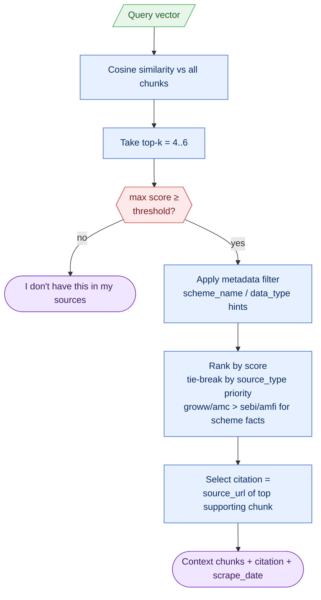

### 5.4 Response Formatter — final compliance gate

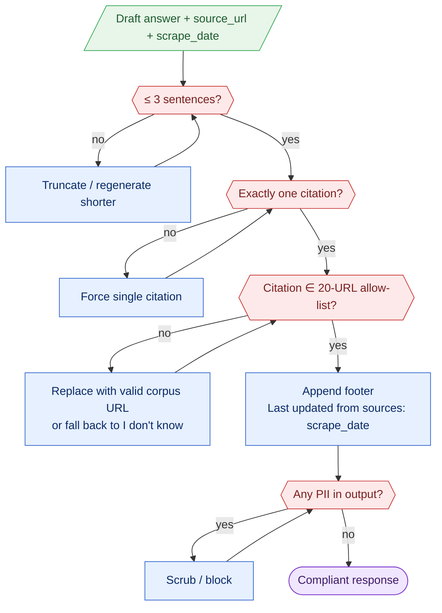

---

## 6. Request Lifecycle State Machine

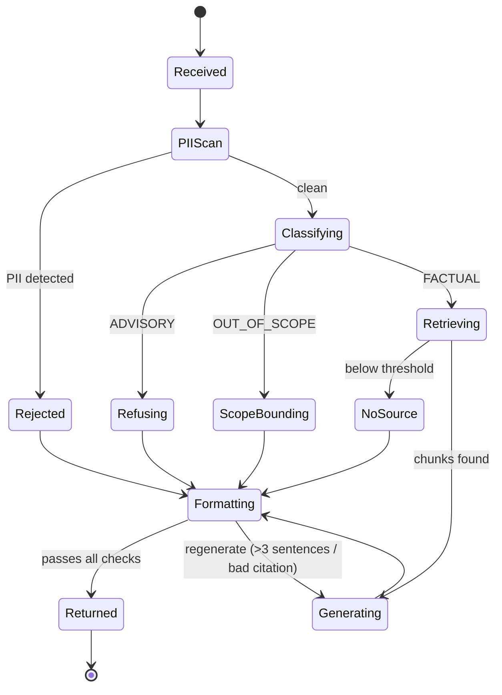

Every terminal path converges on **Formatting**, guaranteeing the output contract (≤3 sentences, one corpus citation, freshness footer, no PII) regardless of which branch produced the content.

---

## 7. Data Contracts (API payloads)

### 7.1 Request

```json
POST /api/query
Content-Type: application/json

{ "query": "What is the expense ratio of HDFC Mid Cap Fund?" }
```

### 7.2 Response (unified schema for all branches)

```json
{
  "answer": "The expense ratio of HDFC Mid Cap Fund Direct Growth is 0.74% (Direct Plan). ...",
  "source_url": "https://groww.in/mutual-funds/hdfc-mid-cap-fund-direct-growth",
  "last_updated": "June 2026",
  "response_type": "FACTUAL | ADVISORY_REFUSAL | OUT_OF_SCOPE | NO_SOURCE | PII_REJECTED",
  "refused": false
}
```

| Field | Source of value | Notes |
|-------|-----------------|-------|
| `answer` | Generator or static responder | Always ≤3 sentences |
| `source_url` | Selected chunk metadata, validated vs allow-list | Exactly one; omitted/educational link for refusals |
| `last_updated` | `scrape_date` of cited chunk | Drives the freshness footer |
| `response_type` | Classifier + retrieval outcome | Enables UI styling/telemetry |
| `refused` | Guardrail/classifier | `true` for PII + advisory paths |

### 7.3 Auxiliary endpoints (read-only metadata)

| Endpoint | Returns | Data source |
|----------|---------|-------------|
| `GET /api/health` | service + index status | in-memory check |
| `GET /api/examples` | 3 pre-loaded example questions | static config |
| `GET /api/meta` | scrape date, 6-scheme list | index metadata + scheme registry |

---

## 8. Data Stores & Ownership

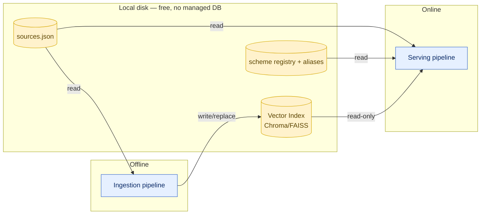

| Store | Owner (writer) | Readers | Lifecycle |
|-------|----------------|---------|-----------|
| Vector Index | Ingestion only | Serving (read-only) | Rebuilt on each ingestion run; replaces prior index |
| `sources.json` | Maintainer (manual) | Ingestion + Formatter (allow-list) | Versioned in git; single source of truth |
| Scheme registry | Maintainer (manual) | Classifier + Scope responder | Canonical names + aliases (e.g., "HDFC Equity Fund" ↔ Flexi Cap) |

**No user data is ever persisted.** Single-turn, stateless serving means queries are processed in memory and discarded; PII-flagged inputs are never logged.

---

## 9. Freshness & Re-Ingestion Data Flow

```mermaid
flowchart LR
    trig[/Manual or scheduled trigger/]:::ext --> rerun[Re-run ingestion]:::proc
    rerun --> newdate[Stamp fresh scrape_date]:::proc
    newdate --> rebuild[Rebuild vectors]:::proc
    rebuild --> swap[Replace persisted index]:::proc
    swap --> idx[(Vector Index)]:::store
    idx --> footer[Serving reads new scrape_date]:::proc
    footer --> shown([Footer shows new date in every answer]):::term

    classDef proc fill:#e6f0ff,stroke:#3366cc,color:#0a2a66
    classDef store fill:#fff2cc,stroke:#d6a700,color:#5c4500
    classDef ext fill:#e8f5e9,stroke:#33aa55,color:#1d5c2e
    classDef term fill:#f0e6ff,stroke:#7a33cc,color:#3d1a66
```

Freshness is a pure data property: the footer date is read from the cited chunk's `scrape_date`, so a re-ingestion automatically updates what users see — no code change required.

---

## 10. Error & Fallback Data Paths

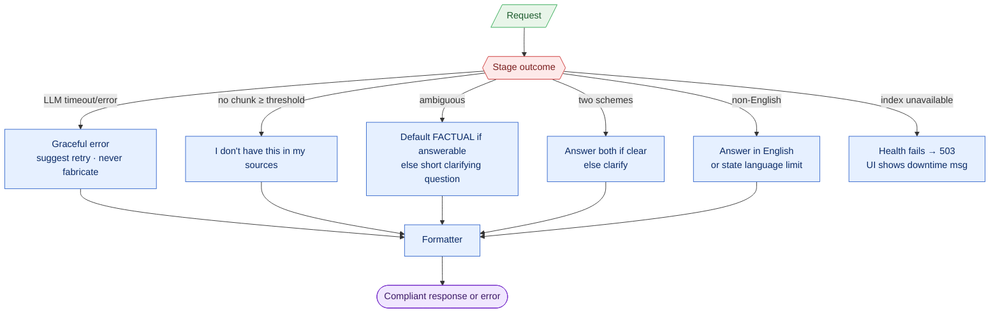

| Failure | Data behavior | Never does |
|---------|---------------|------------|
| LLM error/timeout | Returns retry message | Fabricate an answer |
| Below-threshold retrieval | Returns "not in sources" | Guess from outside corpus |
| Ambiguous query | Defaults to factual or asks one clarifier | Assume advisory intent silently |
| Index down | 503 + friendly UI message | Serve stale/empty hallucination |

---

## 11. Compliance Checkpoints Along the Data Path


| Checkpoint | Enforces (context constraint) | Where in data flow |
|------------|-------------------------------|--------------------|
| CP1 | No PII collection/storage/echo | Before classify/retrieve/generate |
| CP2 | No advice/opinions/predictions | Classifier branch |
| CP3 | No hallucination | Generation grounded only in retrieved context |
| CP4 | Citations only from 20 URLs | Formatter allow-list validation |
| CP5 | ≤3 sentences + freshness footer | Formatter |
| CP6 | No PII leakage in output | Formatter final scan |

---

## 12. Summary

- **Two clean data planes:** ingestion writes the index; serving reads it. The vector index + `sources.json` + scheme registry are the only persistent data.
- **Metadata is the backbone:** citation, freshness, filtering, and ranking all derive from chunk metadata, not from the model — that is what makes the system traceable and hallucination-resistant.
- **Every path converges on the Formatter**, which is the single enforcement point for the output contract.
- **Six compliance checkpoints** sit directly on the data path, in order, so a violation is structurally hard to reach.
- **Fully free data path:** local embeddings, local vector store, Groq free-tier LLM — no paid service touches any stage.

---

*Companion to `Docs/architecture.md` and `Docs/context.md`. Diagrams are Mermaid; render in any Mermaid-aware Markdown viewer (GitHub, VS Code preview, MkDocs, etc.).*
