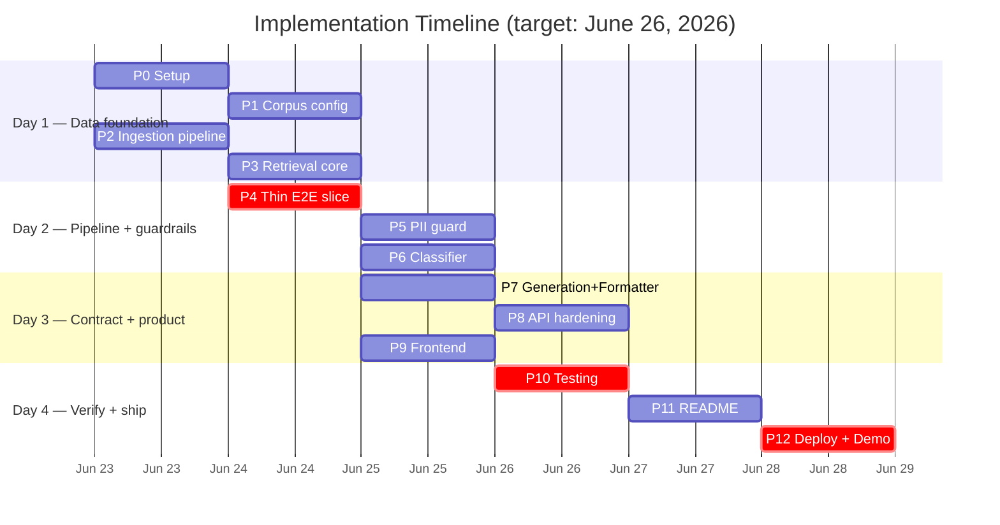
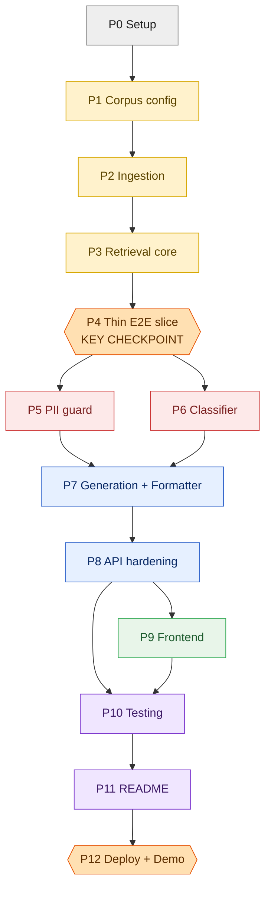
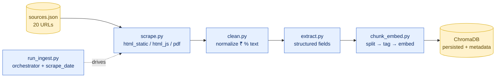
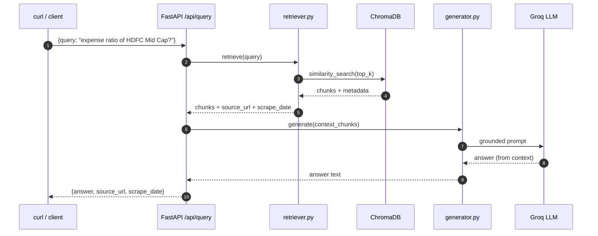
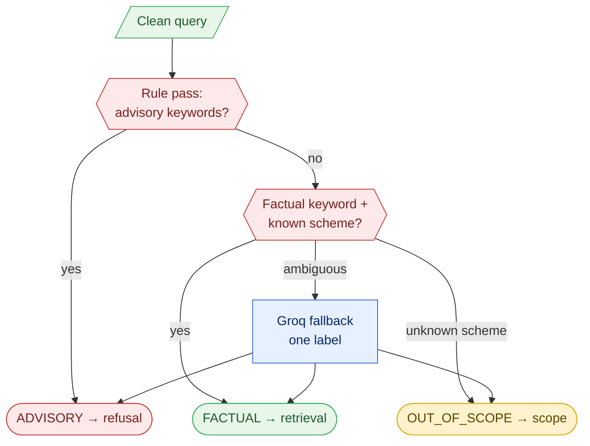
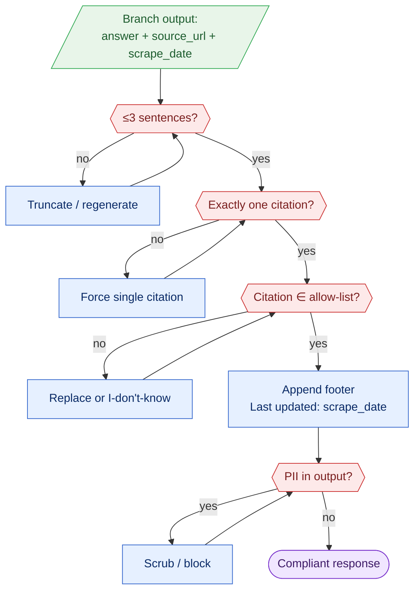
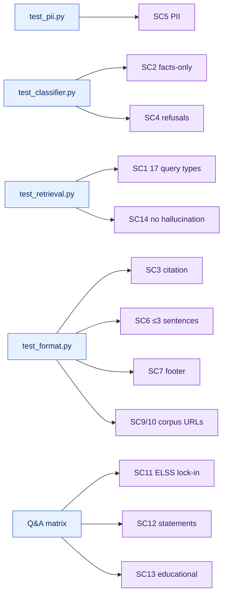
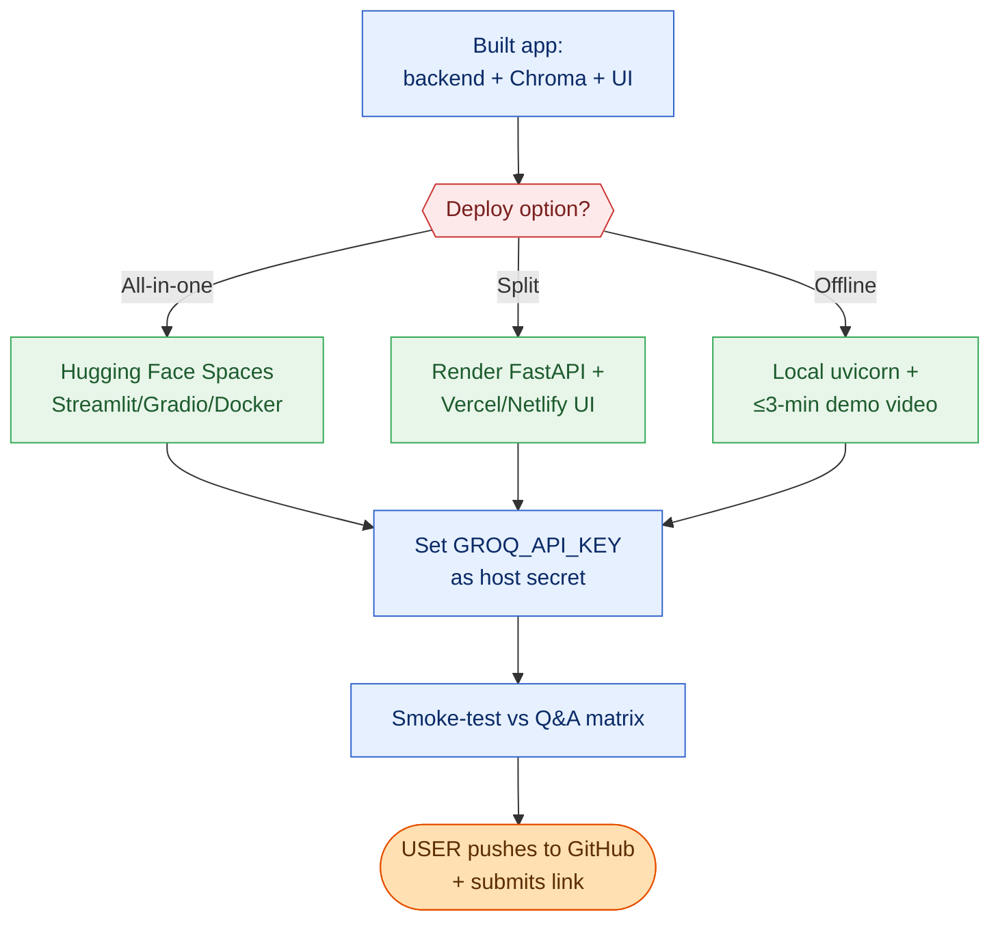

# Implementation Plan: RAG-Based Mutual Fund FAQ Chatbot

> Phase-wise build plan derived from `Docs/context.md`, `Docs/architecture.md`, `Docs/data-flow-architecture.md`, and `Docs/Problem Statement — MF FAQ Chatbot.md`.
> **Stack:** FastAPI + LangChain + local `sentence-transformers` embeddings + local ChromaDB + **Groq** LLM + React/Streamlit UI. **Cost: $0.**
> **Deadline:** June 26, 2026 — 11:59 PM IST. **GitHub push is done by the user, not the AI.**

---

## 0. How to Use This Plan

- Phases are ordered by dependency. Each phase lists: **Goal · Prerequisites · Tasks · Deliverables · Acceptance criteria · Maps to success criteria (SC#) · Est. effort.**
- "SC#" refers to the 15 Success Criteria in `context.md` §12.
- Build vertically: get a thin end-to-end slice working early (Phase 4), then harden each layer.
- Every code change is verified with the project's tests before moving on.

### Phase Overview


### Suggested Timeline (compressed, ~3–4 working days)

| Day | Phases |
|-----|--------|
| Day 1 | P0, P1, P2, P3 |
| Day 2 | P4, P5, P6 |
| Day 3 | P7, P8, P9 |
| Day 4 | P10, P11, P12 |



### Phase Dependency Graph (what blocks what)



> **Critical path:** P0 → P1 → P2 → P3 → **P4** → P7 → P8 → P10 → P11 → P12. P5/P6 and P9 can be worked in parallel once their prerequisites are met.

---

## Phase 0 — Project Setup & Environment

**Goal:** A reproducible, free Python environment and repo skeleton.

**Prerequisites:** Python 3.10+, Node 18+ (only if using React), a free Groq API key.

**Tasks:**
1. Create the repo structure from `architecture.md` §11.
2. Create a virtual environment (`python -m venv .venv`).
3. Add `requirements.txt`:
   - `fastapi`, `uvicorn[standard]`, `pydantic`
   - `langchain`, `langchain-community`, `langchain-text-splitters`
   - `sentence-transformers`, `chromadb`
   - `groq` (official Groq SDK) or `langchain-groq`
   - `requests`, `beautifulsoup4`, `playwright`, `pypdf`, `pdfplumber`
   - `python-dotenv`
   - `pytest`, `httpx` (test client)
4. Create `.env.example` with `GROQ_API_KEY=`, `GROQ_MODEL=llama-3.1-8b-instant`, `EMBEDDING_MODEL=sentence-transformers/all-MiniLM-L6-v2`, `CHROMA_DIR=./data/chroma`, `TOP_K=5`, `SCORE_THRESHOLD=...`.
5. Add `.gitignore` (`.venv`, `.env`, `data/chroma/`, `__pycache__`, `node_modules`).
6. `backend/config.py` — load env vars centrally; never hardcode keys.

**Deliverables:** Repo skeleton, `requirements.txt`, `.env.example`, `.gitignore`, `config.py`.

**Acceptance:** `pip install -r requirements.txt` succeeds; `python -c "import fastapi, chromadb, sentence_transformers, groq"` runs clean.

**Maps to:** Foundation for all SC.

**Est. effort:** 1–2 hrs.

> **Security note:** `.env` must be git-ignored. The user creates the Groq key and pastes it locally; the AI never commits it.

---

## Phase 1 — Corpus Configuration (Single Source of Truth)

**Goal:** Encode the 20-URL allow-list once, used by both ingestion and the citation validator.

**Prerequisites:** Phase 0.

**Tasks:**
1. Create `data/sources.json` — an array of 20 entries, each:
   ```json
   {
     "url": "https://groww.in/mutual-funds/hdfc-mid-cap-fund-direct-growth",
     "source_type": "groww_scheme_page",
     "scheme_name": "HDFC Mid Cap Fund Direct Growth",
     "scheme_category": "Equity — Mid Cap",
     "fetch_mode": "html_js",
     "default_data_type": "scheme_facts"
   }
   ```
   Populate all 20 from `context.md` §5 (6 Groww + 8 AMC + 3 SEBI + 3 AMFI).
2. Create a scheme registry (`data/schemes.json`) — canonical names + aliases (e.g., "HDFC Equity Fund" ↔ "HDFC Flexi Cap Fund"; short forms like "mid cap", "elss", "gold etf").
3. Mark `fetch_mode` per URL: `html_static`, `html_js` (Playwright), or `pdf`.
4. Build a tiny loader (`backend/corpus.py`) exposing `ALLOWED_URLS` (set) for the citation validator.

**Deliverables:** `sources.json` (20 entries), `schemes.json`, `corpus.py`.

**Acceptance:** Loader returns exactly 20 URLs; all domains ∈ {groww.in, hdfcfund.com, sebi.gov.in, investor.sebi.gov.in, amfiindia.com}.

**Maps to:** SC9, SC10 (20 official sources).

**Est. effort:** 1–2 hrs.

---

## Phase 2 — Ingestion Pipeline (Offline, Write-Path)

**Goal:** Turn the 20 URLs into a persisted, metadata-rich vector index.

**Prerequisites:** Phase 1.

**Tasks (per `data-flow-architecture.md` §3):**
1. `ingestion/scrape.py` — fetch by `fetch_mode`:
   - `html_static`: `requests` + `BeautifulSoup`.
   - `html_js`: Playwright (rendered DOM) for Groww scheme pages.
   - `pdf`: `pypdf`/`pdfplumber` for factsheets/KIM/SID.
   - Respectful fetching: set a user agent, add small delays, handle failures gracefully.
2. `ingestion/clean.py` — strip nav/ads/scripts; normalize whitespace, ₹, %, Unicode.
3. `ingestion/extract.py` — targeted parsers for Groww data points (expense ratio, exit load, SIP, lumpsum, riskometer, benchmark, manager + tenure/education/experience, AUM, NAV, launch date, tax, lock-in, stamp duty, category).
4. `ingestion/chunk_embed.py`:
   - Split with `RecursiveCharacterTextSplitter` (~500–800 tokens, ~80 overlap).
   - Tag each chunk with the metadata schema (`source_url`, `source_type`, `scheme_name`, `scheme_category`, `data_type`, `scrape_date`, `chunk_index`).
   - Embed with `all-MiniLM-L6-v2`.
   - Upsert into ChromaDB (persisted to `CHROMA_DIR`).
5. `ingestion/run_ingest.py` — orchestrate all steps; stamp a single `scrape_date` for the run; idempotent (rebuild replaces prior index).

**Deliverables:** Working ingestion scripts; a populated `data/chroma/` index.



**Acceptance:**
- Index contains chunks for all 6 schemes + AMC + SEBI + AMFI pages.
- Every chunk carries complete metadata (spot-check 10 chunks).
- Re-running replaces the index and refreshes `scrape_date`.

**Maps to:** SC1, SC9, SC10, SC11–SC13 (data present), data freshness.

**Est. effort:** 6–10 hrs (scraping is the most variable; Groww JS rendering + PDFs take time).

> **Risk:** Site structure changes / anti-bot. Mitigation: cache raw HTML locally during dev; if a page blocks scraping, fall back to its PDF (factsheet/KIM/SID) or document the gap.

---

## Phase 3 — Retrieval Core (Read-Path)

**Goal:** Given a query, return the right chunks with metadata and a confidence signal.

**Prerequisites:** Phase 2.

**Tasks:**
1. `backend/rag/retriever.py`:
   - Embed query with the **same** model as ingestion.
   - Similarity search top-k (k from env, default 5) with score threshold.
   - Optional metadata pre-filter by `scheme_name`/`data_type` hints.
   - Return chunks + scores + metadata; expose `best_score`.
2. Citation selection helper: pick `source_url` of the top supporting chunk; tie-break by `source_type` priority (groww/amc > sebi/amfi for scheme facts).
3. Threshold tuning harness: small script to print scores for sample queries → set `SCORE_THRESHOLD`.

**Deliverables:** `retriever.py`, threshold value committed to config.

**Acceptance:** For each of the 17 query types, the top chunk is from the correct scheme + data type (manual spot-check); below-threshold queries return "no source" signal.

**Maps to:** SC1, SC14 (no hallucination via threshold).

**Est. effort:** 3–5 hrs.

---

## Phase 4 — Thin End-to-End Slice (Walking Skeleton)

**Goal:** Prove the whole pipeline works for the FACTUAL happy path before hardening.

**Prerequisites:** Phase 3 + a minimal Groq call.

**Tasks:**
1. `backend/rag/generator.py` — call Groq with a grounded system prompt (context = retrieved chunks); enforce "answer only from context".
2. `backend/main.py` — `POST /api/query` that wires: query → retrieve → generate → return raw answer + `source_url` + `scrape_date`.
3. Hardcode-skip guardrails for now (added in P5/P6).
4. Manual test: "What is the expense ratio of HDFC Mid Cap Fund?" returns a grounded answer + correct link.

**Deliverables:** Minimal working `/api/query`.



**Acceptance:** One real factual question returns a correct, source-backed answer end to end.

**Maps to:** SC1, SC3.

**Est. effort:** 2–4 hrs.

> This is the highest-value checkpoint — it de-risks the Groq integration, embedding match, and Chroma read all at once.

---

## Phase 5 — Guardrail Layer 1: PII Guard

**Goal:** Block PII before any processing; never echo or store it.

**Prerequisites:** Phase 4.

**Tasks (per `architecture.md` §3.3 / `data-flow` §5.1):**
1. `backend/guardrails/pii.py` — regex detectors for PAN, Aadhaar, phone, email, account number, OTP (context-gated).
2. On match: return the standard PII rejection message; do not echo; do not log raw input.
3. Wire as the **first** step in `/api/query` (short-circuit).

**Deliverables:** `pii.py` + integration.

**Acceptance:** Inputs containing each PII type are rejected with the standard message; PII never appears in the response or logs.

**Maps to:** SC5; constraints §6.2.

**Est. effort:** 2–3 hrs.

> **Tuning:** Account-number/OTP digit rules can false-positive on AUM/NAV figures in the *query*. Gate OTP/account detection with contextual keywords ("otp", "account", "a/c") to avoid blocking legitimate fact questions.

---

## Phase 6 — Guardrail Layer 2: Query Classifier

**Goal:** Route each clean query to FACTUAL / ADVISORY / OUT_OF_SCOPE.

**Prerequisites:** Phase 5.

**Tasks (per `data-flow` §5.2):**
1. `backend/guardrails/classifier.py`:
   - **Rule pass:** advisory keyword list ("should I", "better", "recommend", "predict", "worth it", "returns will"); factual data-type keywords; scheme registry match.
   - **LLM fallback (Groq):** small classification prompt returning one label for ambiguous queries.
   - Default to FACTUAL when borderline-but-answerable; else clarify.
   - Extract `scheme_hint` / `data_type_hint` for the retriever.
2. Wire branches: ADVISORY → refusal responder; OUT_OF_SCOPE → scope responder; FACTUAL → retrieval.

**Deliverables:** `classifier.py` + branch wiring.



**Acceptance:** All 6 advisory examples → ADVISORY; unknown scheme → OUT_OF_SCOPE; the 17 factual types → FACTUAL.

**Maps to:** SC2, SC4; edge cases §10 (#1, #3, #4).

**Est. effort:** 4–6 hrs.

---

## Phase 7 — Generation Contract + Response Formatter

**Goal:** Guarantee the strict output contract on every branch.

**Prerequisites:** Phase 6.

**Tasks:**
1. Harden `generator.py` system prompt: ≤3 sentences, grounded-only, no advice/predictions/returns, no invented numbers/dates/names; "I don't know" fallback.
2. `backend/responders/refusal.py` — polite facts-only refusal + relevant educational link (AMFI/SEBI from corpus) + footer.
3. `backend/responders/scope.py` — "I cover these 6 schemes…" + hdfcfund.com link + footer.
4. `backend/formatter.py` (the single enforcement point, per `data-flow` §5.4):
   - Sentence-count ≤3 (truncate/regenerate).
   - Exactly one citation, validated ∈ `sources.json` allow-list.
   - Append `Last updated from sources: <scrape_date>`.
   - Final PII-echo scan.
5. Unified response schema `{ answer, source_url, last_updated, response_type, refused }`.

**Deliverables:** Formatter + responders + hardened generator.



**Acceptance:** Every branch's output is ≤3 sentences, has exactly one corpus citation (or educational link), and carries the footer; no PII in output.

**Maps to:** SC2, SC3, SC6, SC7, SC14; constraints §6.3, §6.4.

**Est. effort:** 4–6 hrs.

---

## Phase 8 — API Hardening

**Goal:** Production-sane backend behavior.

**Prerequisites:** Phase 7.

**Tasks:**
1. Aux endpoints: `GET /api/health` (service + index status), `GET /api/examples` (3 example questions), `GET /api/meta` (scrape date, 6-scheme list).
2. CORS restricted to the frontend origin.
3. Error handling per `architecture.md` §9 (LLM timeout → retry message; index down → 503; never fabricate).
4. Logging: classification + retrieval scores only; **never** log PII-flagged inputs.
5. Optional: per-IP rate limit (recommended before any public deploy).

**Deliverables:** Hardened `main.py` + endpoints.

**Acceptance:** Health returns index status; errors degrade gracefully; logs contain no PII.

**Maps to:** Reliability; security note in §3.2.

**Est. effort:** 3–4 hrs.

> **Security flag:** `/api/query` is unauthenticated. For a public live link, add rate limiting (and ideally an API key) to prevent abuse of the Groq quota. A local/demo-video deployment can skip this.

---

## Phase 9 — Frontend (UI)

> **⭐ QUALITY BAR (carry-forward requirement):** build a **very high-quality** frontend, not just a minimal one. Use **React (Vite)**. Aim for a polished, professional product: a coherent design system (typography, spacing, color tokens, HDFC/Groww-appropriate accent), responsive layout, smooth micro-interactions, distinct response-type styling (factual / refusal / scope / no-source / PII), strong empty/loading/error states, and full accessibility (semantic HTML, ARIA, keyboard nav, focus management). Must still satisfy every FR 6.5 element below.

**Goal:** A polished, compliant UI per FR 6.5 (held to the quality bar above).

**Prerequisites:** Phase 8.

**Tasks:**
1. Choose React (Vite) for the "full product" deliverable, or Streamlit for speed (both free).
2. Implement:
   - Welcome message (scope: 6 HDFC schemes, facts-only).
   - 3 clickable example questions (auto-fill input).
   - Always-visible disclaimer: `"Facts-only. No investment advice."`
   - Input field + submit.
   - Response area: answer + clickable citation + `Last updated from sources: <date>` footer.
3. Wire to `/api/query`, `/api/examples`, `/api/meta`.
4. Loading + error states; accessibility (semantic HTML, ARIA labels, keyboard nav).

**Deliverables:** Working UI calling the backend.

**Acceptance:** UI shows welcome + 3 examples + disclaimer; submitting a question renders a formatted, source-linked answer.

**Maps to:** SC8; FR 6.5.

**Est. effort:** 5–8 hrs (React) / 2–3 hrs (Streamlit).

---

## Phase 10 — Testing & Verification

**Goal:** Evidence the system meets all 15 success criteria.

**Prerequisites:** Phases 5–9.

**Tasks (per `architecture.md` §12):**
1. `tests/test_pii.py` — all 6 PII types rejected, no echo. (SC5)
2. `tests/test_classifier.py` — 6 advisory refused; 17 factual routed; unknown scheme → out-of-scope. (SC2, SC4)
3. `tests/test_retrieval.py` — right scheme + data type; below-threshold → "I don't know". (SC1, SC14)
4. `tests/test_format.py` — ≤3 sentences; exactly one citation ∈ allow-list; footer present. (SC3, SC6, SC7, SC9, SC10)
5. Targeted checks: ELSS lock-in → "3 years" (SC11); CAS/capital-gains → process + link (SC12); "what is a mutual fund?" from AMFI/SEBI (SC13).
6. A scripted Q&A matrix covering all 17 factual + 6 refusal + key edge cases (§10).
7. Run the full suite; fix failures before proceeding.

**Deliverables:** Passing test suite + a recorded Q&A matrix (feeds the README sample Q&A).



**Acceptance:** All tests green; manual matrix shows zero advisory leakage and zero hallucination.

**Maps to:** SC1–SC14.

**Est. effort:** 5–7 hrs.

---

## Phase 11 — Documentation & README

**Goal:** Complete the README per the required structure.

**Prerequisites:** Phase 10.

**Tasks (per `context.md` §11 / Problem Statement §10.2):**
1. `README.md` sections: Overview · Product Context (Groww, HDFC MF) · Schemes Covered (6) · Setup Instructions · Architecture (RAG diagram) · Source List (20 URLs) · Sample Q&A (5–10 with citations) · Disclaimer · Known Limitations.
2. Pull the 20-URL table from `context.md` §5.
3. Pull 5–10 real Q&A pairs (with citations + footer) from the Phase 10 matrix.
4. Disclaimer snippet in README + confirm it's in the UI.
5. Known limitations table from `context.md` §13.
6. Setup steps: env, install, ingest, run backend, run frontend.

**Deliverables:** Complete `README.md`.

**Acceptance:** Every required section present; source list = 20; sample Q&A = 5–10; disclaimer in both README and UI.

**Maps to:** SC8, SC9, SC15.

**Est. effort:** 2–4 hrs.

---

## Phase 12 — Deployment & Demo

**Goal:** A live link or a ≤3-min demo video, plus the user's GitHub push.

**Prerequisites:** Phase 11.

**Tasks (per `architecture.md` §10):**
1. Pick a free host:
   - All-in-one: **Hugging Face Spaces** (Streamlit/Gradio or Docker) bundling backend + Chroma index, calling Groq.
   - Or split: Render (FastAPI) + Vercel/Netlify (frontend).
   - Or local run + recorded ≤3-min demo video.
2. Set `GROQ_API_KEY` as a host secret (not in code).
3. Smoke-test the deployed app against the Q&A matrix.
4. Record the demo video if not using a live link.
5. **User action:** push to GitHub and submit the link (the AI does not push).

**Deliverables:** Live link or demo video; GitHub repo ready for the user to push.



**Acceptance:** Deployed app answers factual questions, refuses advisory, rejects PII; submission artifacts ready.

**Maps to:** Deliverables checklist (Problem Statement §10.1).

**Est. effort:** 3–5 hrs.

> **Cost reminder:** All hosting options above have free tiers requiring no credit card. The only external call is to Groq's free-tier API.

---

## Cross-Cutting Concerns (apply across all phases)

| Concern | Practice |
|---------|----------|
| Secrets | `GROQ_API_KEY` in `.env`/host secrets only; never committed. |
| Privacy | No user data persisted; PII-flagged inputs never logged. |
| Determinism | PII + format enforcement are regex/rules, not LLM-dependent. |
| Grounding | LLM answers only from retrieved context; threshold + "I don't know" prevent hallucination. |
| Traceability | Citation + freshness derive from chunk metadata, not the model. |
| Reproducibility | Pinned `requirements.txt`; ingestion is idempotent. |

---

## Risk Register

| Risk | Likelihood | Impact | Mitigation |
|------|-----------|--------|------------|
| Groww anti-bot / JS rendering issues | Med | High | Playwright; cache raw HTML in dev; fall back to AMC PDFs |
| PDF parsing noise (KIM/SID/factsheets) | Med | Med | `pdfplumber` for tables; targeted extraction; chunk cleanup |
| Classifier misroutes ambiguous queries | Med | Med | Rule pass + LLM fallback; default-to-factual-if-answerable |
| PII regex false positives on AUM/NAV | Med | Low | Context-gate OTP/account detection |
| Groq free-tier rate limits | Low | Med | Cache classification; keep prompts short; backoff/retry |
| Data staleness (NAV/AUM drift) | High | Low | `scrape_date` footer; documented re-ingestion |
| Time overrun before deadline | Med | High | Prioritize thin E2E slice (P4); Streamlit UI if React slips |

---

## Definition of Done (project-level)

- [ ] All 17 factual query types answer correctly with one corpus citation + footer. (SC1, SC3, SC6, SC7)
- [ ] All 6 advisory types refused with educational link. (SC4)
- [ ] All PII types detected and rejected, no echo/store. (SC5)
- [ ] No hallucination — unknown facts → "I don't have this in my sources." (SC14)
- [ ] ELSS lock-in, CAS/capital-gains, and AMFI/SEBI educational queries verified. (SC11–SC13)
- [ ] UI has welcome + 3 examples + disclaimer. (SC8)
- [ ] README complete with 20-URL source list + 5–10 sample Q&A + disclaimer. (SC9, SC10, SC15)
- [ ] Working prototype reachable (live link or ≤3-min demo video).
- [ ] $0 spend confirmed; `GROQ_API_KEY` kept out of source.
- [ ] User has pushed the repo to GitHub and submitted the link.

---

*Source docs: `context.md`, `architecture.md`, `data-flow-architecture.md`, `Problem Statement — MF FAQ Chatbot.md`. Effort estimates are indicative; the thin end-to-end slice in Phase 4 should be reached as early as possible to de-risk integration.*
